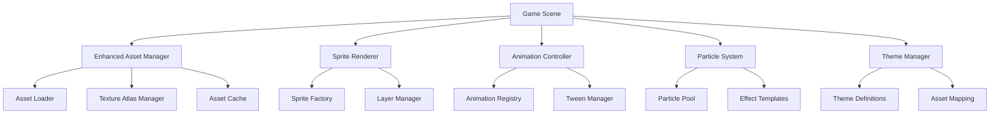

# 2D Art Enhancement Design Document

## Overview

This design outlines the transformation of the maze game from basic geometric shapes to a rich 2D art experience. The system will implement a comprehensive art pipeline including sprite management, animation systems, particle effects, and themed visual elements while maintaining performance and extensibility.

The design follows a modular approach where visual enhancements are layered on top of the existing game core without disrupting the underlying game logic. This ensures backward compatibility and allows for gradual implementation.

## Architecture

### High-Level Architecture



### Asset Pipeline

The art system will use a structured asset pipeline:

1. **Source Assets**: High-resolution PNG/SVG files organized by category
2. **Texture Atlases**: Optimized sprite sheets for efficient loading
3. **Asset Manifests**: JSON configurations defining sprites, animations, and themes
4. **Runtime Loading**: Intelligent preloading and caching system

## Components and Interfaces

### Enhanced Asset Manager

Extends the existing AssetManager with comprehensive 2D art support:

```typescript
interface IEnhancedAssetManager extends IAssetManager {
  loadTextureAtlas(atlasKey: string, imagePath: string, dataPath: string): Promise<void>;
  getSprite(spriteKey: string): Phaser.GameObjects.Sprite;
  getAnimation(animKey: string): Phaser.Animations.Animation;
  preloadThemeAssets(themeId: string): Promise<void>;
  getThemeAsset(themeId: string, assetType: string, assetKey: string): any;
}
```

**Key Features:**
- Texture atlas management for efficient memory usage
- Theme-based asset organization
- Automatic sprite sheet parsing
- Progressive loading with fallbacks
- Memory optimization and garbage collection

### Sprite Renderer System

Replaces basic shapes with rich 2D sprites:

```typescript
interface ISpriteRenderer {
  createPlayerSprite(position: Position, theme: string): Phaser.GameObjects.Sprite;
  createOrbSprite(orbData: OrbState, theme: string): Phaser.GameObjects.Sprite;
  createMazeTiles(mazeData: MazeCell[][], theme: string): Phaser.GameObjects.Group;
  createUIElements(uiConfig: UIConfig, theme: string): UIElementGroup;
  updateSpriteTheme(sprite: Phaser.GameObjects.Sprite, newTheme: string): void;
}
```

**Rendering Layers:**
1. **Background Layer**: Environmental backgrounds and atmospheric elements
2. **Maze Layer**: Wall tiles, floor tiles, and structural elements  
3. **Game Object Layer**: Player, orbs, and interactive elements
4. **Effect Layer**: Particles, animations, and visual feedback
5. **UI Layer**: Interface elements and overlays

### Animation Controller

Manages all sprite animations and transitions:

```typescript
interface IAnimationController {
  registerAnimation(key: string, config: AnimationConfig): void;
  playAnimation(sprite: Phaser.GameObjects.Sprite, animKey: string): Promise<void>;
  createMovementAnimation(sprite: Phaser.GameObjects.Sprite, from: Position, to: Position): Phaser.Tweens.Tween;
  createCollectionEffect(position: Position, effectType: string): Promise<void>;
  createTransitionEffect(fromScene: string, toScene: string): Promise<void>;
}
```

**Animation Types:**
- **Idle Animations**: Subtle breathing/floating effects for static elements
- **Movement Animations**: Directional walking/rolling animations for player
- **Collection Animations**: Orb pickup effects with scaling and particles
- **Feedback Animations**: Button presses, invalid moves, completion celebrations
- **Transition Animations**: Scene changes and level progression

### Particle System

Provides rich visual effects and atmosphere:

```typescript
interface IParticleSystem {
  createEffect(effectType: string, position: Position, config?: EffectConfig): Phaser.GameObjects.Particles.ParticleEmitter;
  createAmbientEffect(areaConfig: AreaConfig): Phaser.GameObjects.Particles.ParticleEmitter;
  stopEffect(effectId: string): void;
  updateEffectPosition(effectId: string, newPosition: Position): void;
}
```

**Effect Categories:**
- **Collection Effects**: Sparkles, energy bursts, score popups
- **Movement Effects**: Dust trails, footsteps, motion blur
- **Ambient Effects**: Floating particles, light rays, atmospheric elements
- **Completion Effects**: Confetti, fireworks, celebration particles
- **Environmental Effects**: Theme-specific atmospheric particles

### Theme Manager

Handles visual themes and art style variations:

```typescript
interface IThemeManager {
  loadTheme(themeId: string): Promise<ThemeDefinition>;
  getCurrentTheme(): ThemeDefinition;
  switchTheme(newThemeId: string): Promise<void>;
  getThemeAssets(themeId: string): AssetCollection;
  registerCustomTheme(themeDefinition: ThemeDefinition): void;
}
```

**Theme Structure:**
- **Base Theme**: Default art style with forest/nature elements
- **Level Themes**: Variations for different level types (cave, crystal, ancient)
- **Seasonal Themes**: Holiday and seasonal variations
- **Custom Themes**: User-generated or DLC theme support

## Data Models

### Asset Configuration

```typescript
interface AssetManifest {
  version: string;
  themes: ThemeDefinition[];
  atlases: AtlasDefinition[];
  animations: AnimationDefinition[];
  particles: ParticleDefinition[];
}

interface ThemeDefinition {
  id: string;
  name: string;
  description: string;
  assets: {
    player: SpriteAsset;
    orbs: SpriteAsset[];
    maze: MazeAssets;
    ui: UIAssets;
    effects: EffectAssets;
  };
  colors: ColorPalette;
  sounds: SoundAssets;
}

interface SpriteAsset {
  key: string;
  atlas: string;
  frame: string;
  animations?: string[];
  scale?: number;
  anchor?: { x: number; y: number };
}
```

### Animation Configuration

```typescript
interface AnimationDefinition {
  key: string;
  atlas: string;
  frames: AnimationFrame[];
  frameRate: number;
  repeat: number;
  yoyo?: boolean;
}

interface AnimationFrame {
  frame: string;
  duration?: number;
}
```

### Particle Configuration

```typescript
interface ParticleDefinition {
  key: string;
  texture: string;
  config: {
    scale: { start: number; end: number };
    speed: { min: number; max: number };
    lifespan: { min: number; max: number };
    alpha: { start: number; end: number };
    tint: number[];
    blendMode: string;
  };
}
```

## Error Handling

### Asset Loading Failures

1. **Progressive Fallbacks**: If themed assets fail, fall back to basic shapes
2. **Retry Logic**: Automatic retry with exponential backoff for network issues
3. **Error Reporting**: Detailed logging for debugging and analytics
4. **Graceful Degradation**: Game remains playable even with missing assets

### Performance Monitoring

1. **Memory Usage**: Track texture memory and implement cleanup
2. **Frame Rate**: Monitor performance and adjust quality dynamically
3. **Loading Times**: Optimize asset loading based on device capabilities
4. **Battery Usage**: Implement power-saving modes for mobile devices

### Asset Validation

1. **Format Validation**: Ensure assets meet technical requirements
2. **Size Validation**: Prevent oversized assets from causing memory issues
3. **Dependency Checking**: Verify all referenced assets exist
4. **Version Compatibility**: Handle asset version mismatches gracefully

## Testing Strategy

### Visual Testing

1. **Screenshot Comparison**: Automated visual regression testing
2. **Animation Validation**: Verify animation timing and smoothness
3. **Theme Consistency**: Ensure all themes render correctly
4. **Cross-Platform Testing**: Validate appearance across devices

### Performance Testing

1. **Memory Profiling**: Monitor texture memory usage patterns
2. **Frame Rate Analysis**: Ensure consistent 60fps performance
3. **Loading Time Benchmarks**: Measure asset loading performance
4. **Battery Impact Testing**: Validate power consumption on mobile

### Integration Testing

1. **Asset Pipeline Testing**: Verify complete asset loading workflow
2. **Theme Switching Testing**: Ensure smooth theme transitions
3. **Animation Synchronization**: Test animation timing with game events
4. **Fallback Testing**: Verify graceful degradation scenarios

## Implementation Phases

### Phase 1: Core Infrastructure
- Enhanced Asset Manager implementation
- Basic sprite rendering system
- Texture atlas support
- Theme management foundation

### Phase 2: Player and Orb Sprites
- Player character sprite implementation
- Orb sprite system with variations
- Basic movement animations
- Collection effect particles

### Phase 3: Maze Visualization
- Tile-based maze rendering
- Wall and floor texture system
- Environmental background elements
- Lighting and shadow effects

### Phase 4: UI Enhancement
- Themed button and interface sprites
- Animated UI transitions
- Loading screen improvements
- Menu system visual overhaul

### Phase 5: Advanced Effects
- Comprehensive particle system
- Advanced animation sequences
- Environmental atmosphere
- Performance optimization

### Phase 6: Theme System
- Multiple theme support
- Theme switching functionality
- Custom theme creation tools
- Seasonal theme variations